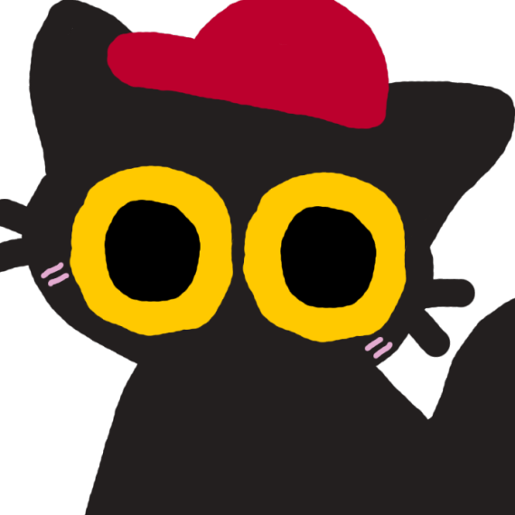

# what's good gang i'm mariopuff 🐈

> you can call me mowko! (or liminalsoups for abstractness but i’d be surprised if you use that name!!)

<i>that’s momo,  he’s just vibing. →</i>

  

  

shout out to my github bros:

---

## 👤 about me

🎮 game developer (4-year degree in Scratch, new to GameMaker!)  
🎨 part-time designer & illustrator  
🏁 host of the F-FORMULA championship  
🧱 working on a *Balatro* mod  
🚀 learning GameMaker Studio from the ground up – mechanics, language, assets, etc.  
⭐ tyler, the creator fan  
🐱 fun fact: i have a really strong love for cats!!

---

## 🛠️ tools & technologies

 
 
 
 
 
 
 
 
 
 

---

## 👥 groups and teams

---

## ❓ ask me about

💬 my game/projects  
🏎️ formula one (especially Max Verstappen!)  
📦 game design, mechanics, and Scratch stuff  
🎤 tyler tracks and albums
         

<b>TU DU DU DU MAX VERSTAPPEN</b>

---

## ✨ featured work

### 🚧 **Fulltimate Custom Night | codename [[CUSTOMIZABLENIGHTMARES](https://github.com/submini/customizablenightmares)]**  
🎮 GameMaker port in progress...  
👥 Working with my friends [UN4YA](https://github.com/UN4YA) and [interseer](https://github.com/4unduck) *(formerly 4unduck)*  
🧠 Mechanics, systems, FNAF-style strategy, character AIs  
🐾 80 characters tracked and managed in Scratch 3.0! But none so far in GameMaker...  

**⛔️ currently cancelled**

### 🃏 **[Shuffle-Puffle](https://github.com/submini/shuffle-puffle) | *Balatro* mod**  
🎮 Currently still in development  
📜 Not published to skyline69's [balatro-mod-index](https://github.com/skyline69/balatro-mod-index)... yet  
👥 Still working with my friends [UN4YA](https://github.com/UN4YA) and [interseer](https://github.com/4unduck) *(formerly 4unduck)*  
📍 Currently 45 jokers and 1 booster pack (this information may go outdated soon)  

---

## 📊 github stats

---

## 🔗 find me everywhere

---

> *"You know what that is? Simply lovely! I'll tell you that!"*  
> – Max Verstappen, Brazilian GP 2024

---

### credits

some sections inspired by !
